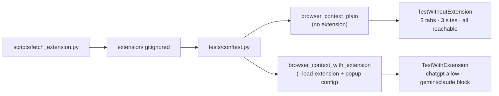

# Prompt Security — GenAI access policy automation

Automation that validates the **Prompt Security Browser Extension** enforces administrator policy for web GenAI apps. The suite runs **6 black-box scenarios** in two pytest classes — each backed by its own Playwright fixture — covering the full *baseline vs. policy-enforced* matrix:

| Class (fixture) | Tab 1 — ChatGPT | Tab 2 — Gemini | Tab 3 — Claude AI |
|---|---|---|---|
| `TestWithoutExtension` (`browser_context_plain`) | No block — site reachable | No block — site reachable | No block — site reachable |
| `TestWithExtension` (`browser_context_with_extension`) | No block — *allow* policy | **BLOCK** — Access Denied overlay | **BLOCK** — Access Denied overlay |

Each block assertion checks the structured query parameters of the extension's overlay URL (`type=blockPage`, `domain=<expected>`) and the runtime `chrome-extension://<id>` resolved by the fixture from the MV3 service worker URL.

Stack: Python 3.12, **pytest**, **pytest-asyncio**, async **Playwright**, **Allure**, **POM**, **uv**, **ruff**. Optional **Notion** “Test Runs” reporter (same fail-open design as the parent boilerplate).

## Architecture



Both fixtures share a single private lifecycle helper (`_persistent_context_lifecycle`) so the only behavioural delta is the `--load-extension` flags + popup configuration.

## Prerequisites

- [uv](https://docs.astral.sh/uv/) and Python 3.12+
- Prompt Security **API key** and **API domain** (same values you enter in the extension popup)
- Network access to ChatGPT, Gemini, and Chrome Web Store CRX endpoint

## Local setup

```bash
cd PromptSecurity_HomeAssignment
uv sync --all-groups
uv run playwright install --with-deps chromium
cp .env.example .env
# Edit .env: set PROMPT_SECURITY_API_KEY (never commit real values)
make extension   # or: uv run python scripts/fetch_extension.py
uv run pytest -m smoke -v
```

Tests run **headed** Chromium with the extension (CI uses **Xvfb**). HTML report: `reports/report.html`. Allure raw results: `reports/allure-results/`.

## GitHub Actions CI

Workflow: [`.github/workflows/ci.yml`](.github/workflows/ci.yml).

1. Install uv, sync deps, install Playwright Chromium.
2. **Fetch + unpack** the extension (`scripts/fetch_extension.py`).
3. Install **Xvfb**, then run **`xvfb-run … uv run pytest -v`** so headed Chromium works on `ubuntu-latest`.
4. Upload Allure results, HTML report, summary, screenshots, traces.

### Required secret

| Name | Type | Purpose |
|------|------|---------|
| `PROMPT_SECURITY_API_KEY` | **Secret** | Extension API key (same as in the extension settings). |

Optional repository **Variables** (defaults in code match the vendor assignment): `PROMPT_SECURITY_API_DOMAIN` (`eu.prompt.security`), `CHROME_STORE_EXTENSION_ID` (only affects CRX download).

### Submission links

- **CI workflow:** [github.com/talmalek/prompt-security-home-assignment/actions/workflows/ci.yml](https://github.com/talmalek/prompt-security-home-assignment/actions/workflows/ci.yml)
- **Latest green run:** [run #24954324442](https://github.com/talmalek/prompt-security-home-assignment/actions/runs/24954324442) — `2 passed`. Gemini block assertion proves extension enforcement: navigation lands on `chrome-extension://<runtime-id>/html/pageOverlay.html?type=blockPage&domain=gemini.google.com`, with DOM markers (`Access Denied` title + `Powered by:` link to `prompt.security`) attached as Allure evidence. Same run posts a row to the Notion dashboard.
- **Allure report (GitHub Pages):** <https://talmalek.github.io/prompt-security-home-assignment/> — published by [`.github/workflows/allure-report.yml`](.github/workflows/allure-report.yml) after every CI run on `main`.
- **Notion stakeholder dashboard:** *“QA Automation Test Runs (Prompt Security)”* in the Tal Malek Notion workspace — every CI run on `main` appends one row (status, duration, branch/commit, links to the CI run + Allure report). Page is workspace-private by default; enable **Share → Publish to web** to expose externally.

## Notion stakeholder dashboard

Lightweight reporter that posts one row per CI run to a Notion *Test Runs* database. **Opt-in and fail-open** — a Notion outage never fails CI (`continue-on-error: true` plus `if: env.NOTION_TOKEN != ''` gating).

| Where | What |
|---|---|
| `utils/notion_client.py` | Async httpx + tenacity wrapper; `TestRunRow` pydantic model. |
| `utils/pytest_summary.py` | Zero-dep pytest plugin → writes `reports/summary.json`. |
| `scripts/push_to_notion.py` | CI publisher (also runs locally). Always exits 0. |
| `scripts/smoke_notion.py` | Read-only schema/auth pre-flight. |
| `scripts/reshape_notion_page.py` | One-off page curator — idempotent, **not** in CI. |

To wire a fresh page yourself:

1. Create an internal integration at [Notion → Integrations](https://www.notion.so/profile/integrations) (workspace owner permissions).
2. Duplicate the curated page (or create one with a `Test Runs` database whose schema matches `scripts/smoke_notion.py`).
3. Open the page → **⋯ → Connections → Add connections → confirm** (this is the step most often missed).
4. GitHub: Secret `NOTION_TOKEN`, Variables `NOTION_RUNS_DATABASE_ID`, `ALLURE_PAGES_URL`.
5. Locally validate, then publish: `uv run python scripts/smoke_notion.py && uv run python scripts/push_to_notion.py`.
6. Optionally re-curate the page narrative for your repo: `uv run python scripts/reshape_notion_page.py` (update `PAGE_ID`, `REPO_URL`, `ALLURE_URL` constants first).

## Test design notes

- **Black-box**: assertions are on user-visible outcomes, not extension internals.
- **Two fixtures, one lifecycle helper** — `browser_context_plain` and `browser_context_with_extension` both delegate to `_persistent_context_lifecycle()` in `tests/conftest.py`. The with-extension variant additionally loads the unpacked extension and saves API domain + key in the popup before yielding.
- **One generic page object** (`tests/pages/web_app_page.py::WebGenAiAppPage`) with three site descriptors (`CHATGPT`, `GEMINI`, `CLAUDE`). The post-navigation snapshot returns either a "real web origin" record or an `overlay` sub-dict capturing the extension's block-overlay metadata (`extension_id`, `type`, `domain`, `originalUrl`, `title_text`, `powered_by`).
- **Block evidence is structural**, not heuristic: assertions key off the parsed `chrome-extension://<id>/html/pageOverlay.html?type=blockPage&domain=…` query string. Failure messages double as diagnostic output (e.g. *"overlay declares wrong blocked domain — expected 'claude.ai', got 'gemini.google.com'"*).
- **Soft assertions** via `utils/soft_assert.py::SoftAssert` per project convention — every check is its own Allure step and all collected failures are reported together at teardown.
- **Trade-offs**: headed + Xvfb in CI is slower but reliable for MV3 extensions; locators may need updates if vendors change their UIs.

## Risks and assumptions

- Policy is **backend-driven** via your API key; tests assume the assigned policy *allows* ChatGPT and *blocks* Gemini and Claude AI.
- "Site loads" in the without-extension class is intentionally lenient — login walls / regional redirects are accepted as long as the navigation isn't intercepted by an extension overlay. The actual landing URL is captured in Allure for review.
- Vendor UIs change; the generic page object only relies on URL structure (which is stable) and a couple of optional DOM markers from the extension's own block overlay — minimising flaky failure modes.

## Intentionally out of scope

- PII / DLP logic inside the extension
- Network interception or MITM-style tooling
- Over-engineered policy DSL or multi-tenant admin UIs

## License

MIT — see [LICENSE](LICENSE).
