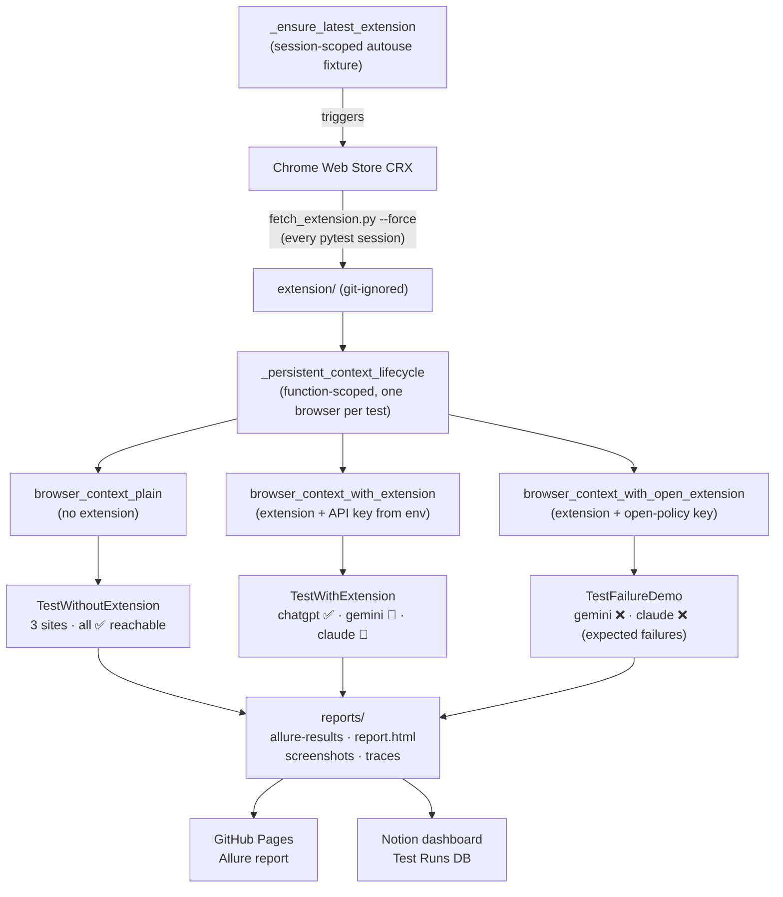

# Prompt Security — GenAI access policy automation

Automation that validates the **Prompt Security Browser Extension** enforces administrator policy for web GenAI apps.

The suite runs **8 test scenarios** across three pytest classes, each backed by its own Playwright fixture:

| Class | Fixture | ChatGPT | Gemini | Claude AI |
|---|---|---|---|---|
| `TestWithoutExtension` | `browser_context_plain` | ✅ No block | ✅ No block | ✅ No block |
| `TestWithExtension` | `browser_context_with_extension` | ✅ No block (allow) | 🛑 **BLOCK** overlay | 🛑 **BLOCK** overlay |
| `TestFailureDemo` | `browser_context_with_open_extension` | — | ❌ Expected FAIL | ❌ Expected FAIL |

> The 2 demo tests use a **real API key with no block rules** to intentionally trigger
> assertion failures — they demonstrate the full failure-reporting pipeline
> (Allure step diff, screenshot, page source, Playwright trace).
> CI stays green via `continue-on-error: true`.

---

## How the infrastructure works

### 1 — Extension acquisition

`scripts/fetch_extension.py` downloads the CRX from the Chrome Web Store, strips
the CRX header, and unzips the payload to `extension/` (git-ignored).  The
unpacked directory is referenced by two Chromium launch flags:

```
--load-extension=<abs-path>
--disable-extensions-except=<abs-path>
```

This happens automatically **once per pytest session, on every run**, both
locally and in CI.  The mechanism lives in
`tests/conftest.py::_ensure_latest_extension` — a session-scoped autouse fixture
that calls `fetch_and_unpack(force=True)` before any test boots a browser, wipes
the previous on-disk copy, and logs the resolved manifest version for
traceability.

> **Always testing the latest release — local and CI alike.**
> The download hits Google's own auto-update endpoint
> (`clients2.google.com/service/update2/crx`) — the same URL Chrome uses for
> extension updates — which always redirects to the **currently published CRX**.
> Because the autouse fixture force-refreshes on every pytest session, both
> environments are guaranteed to exercise the same, up-to-the-minute extension
> version.  No more "works on my machine" caused by a stale local
> `extension/` folder vs. CI's ephemeral runner pulling fresh.
>
> The CI workflow also runs `python scripts/fetch_extension.py --force` as a
> dedicated step *before* pytest.  This is intentional belt-and-suspenders: a
> Chrome Web Store outage fails CI with a clear, dedicated step rather than
> being buried inside the pytest output.  If the dedicated step fails but the
> on-disk copy from a previous run exists locally, the autouse fixture logs a
> warning and continues with the cached version (CI runners are always
> ephemeral, so there is never a stale cache there).
>
> If you need to pre-fetch outside of pytest (e.g. to inspect the CRX, or work
> offline after the initial pull), run:
> ```bash
> make extension   # equivalent to: uv run python scripts/fetch_extension.py --force
> ```

### 2 — Browser context fixtures

All fixtures are backed by a single shared lifecycle helper in `tests/conftest.py`:

```
_persistent_context_lifecycle(instance_id, with_extension, api_key_override?)
```

The helper is **function-scoped** — every test gets its own freshly-launched browser
on a wiped user-data directory.  This trades a few seconds of extension-popup
re-configuration per test for two strong properties:

1. **Cloudflare resilience** — accumulated `__cf_bm` / `cf_clearance` cookies and
   bot-score reputation cannot leak between tests, so a Cloudflare challenge tripped
   by one site can't bias the next.  Without this isolation, ChatGPT's Cloudflare
   "Verify you are human" wall regularly returned mid-suite even after a successful
   first-test bypass.
2. **True per-test isolation** — no shared cookies, `localStorage`, or `IndexedDB`.

The lifecycle steps:
1. Wipes and recreates `reports/.user-data/<instance_id>/` (keyed by pytest `node.name`,
   so parallel runs cannot collide on the same on-disk profile).
2. Launches `pw.chromium.launch_persistent_context` — headed, Xvfb in CI — with
   the Cloudflare bypass layered in (see *Anti-bot mitigations* below).
3. **If `with_extension=True`:** resolves the runtime `chrome-extension://<id>` from
   the MV3 service-worker URL (the id differs from the CRX Store id), opens the
   extension popup and saves the API domain + key, then runs a **policy-activation
   barrier** that probes a known-blocked site until the extension actually intercepts
   it.  This eliminates the policy-fetch race that surfaces with per-test fixtures
   on fast-redirecting targets (e.g. Claude → `/login` in <500 ms).
4. Starts a Playwright trace (`screenshots=True`, `snapshots=True`, `sources=True`).
5. On teardown: stops the trace → `reports/traces/<instance_id>.zip`, closes the
   context.

#### Anti-bot mitigations

ChatGPT and Claude AI both sit behind a Cloudflare Managed Challenge.  Three
complementary layers keep the suite green:

* **Per-test fresh persistent context** (most impactful) — see scope above.
* **`--disable-blink-features=AutomationControlled`** — removes the
  `navigator.webdriver` flag at the browser process level.
* **`user_agent` override + `add_init_script` patches** — pin the UA to a stable
  Chrome version and patch the JS surface bot checks read: `navigator.webdriver`,
  `plugins`, `languages`, `hardwareConcurrency`, `deviceMemory`, the `chrome.runtime`
  stub, and the Permissions API.

Three fixtures call this helper:

| Fixture | `with_extension` | `api_key_override` |
|---|---|---|
| `browser_context_plain` | `False` | — |
| `browser_context_with_extension` | `True` | `settings.extension.api_key` (from env) |
| `browser_context_with_open_extension` | `True` | `cc6a6cfc-…` (open-policy key, hard-coded) |

### 3 — What the tests check

#### Baseline — `TestWithoutExtension`

Three tests, one site each.  Navigates to ChatGPT / Gemini / Claude AI and asserts
the final URL scheme is `https` (not `chrome-extension://`).  This proves the three
sites are reachable in a vanilla browser — i.e. any block detected in
`TestWithExtension` is attributable to the extension, not the environment.

#### Policy enforcement — `TestWithExtension`

Three tests, one site each:

* **ChatGPT (allow):** final URL is a normal web origin (no `chrome-extension://`
  redirect, no overlay snapshot) — extension respects the allow rule.
* **Gemini (block):** final URL is
  `chrome-extension://<runtime-id>/html/pageOverlay.html?type=blockPage&domain=gemini.google.com&canBypass=Prevent&useBackendHtml=true&popupToken=…`.
  Assertions verify **both** the URL query (`type`, `domain`, extension id,
  `canBypass`, `useBackendHtml=true`, non-empty `popupToken`) **and** the rendered
  DOM of the v7.1.0+ backend-rendered overlay (see below) — so a failure message
  is precise about *which* part drifted.
* **Claude AI (block):** same shape as Gemini, with `domain=claude.ai`.

DOM contract for the **v7.1.0+ backend-rendered overlay** (the only UI the
suite supports — see "Always testing the latest release" above):

| Selector | Asserted property |
|---|---|
| `body.ai-site`            | class present (single signal that we're on the latest backend-rendered overlay) |
| `h1.title`                | non-empty text containing *Denied* (the "Access Denied" headline) |
| `p.description`           | non-empty text containing *administrator* and *blocked* (the reason copy) |
| `p.guidelines`            | non-empty text mentioning *guidelines* or *information* (the policy hint copy) |
| `.barrier-illustration` (`#illustrationBlock`) | element present (the roadblock SVG — visual signal of the block UI) |
| `.powered-by`             | element present (Prompt Security branding container) |

The page object (`tests/pages/web_app_page.py::assess_state`) smart-waits on
`document.querySelector('h1.title')?.textContent` becoming non-empty before
reading the snapshot — the v7.1.0 overlay ships an empty `<body>` and the
bundle injects the backend-rendered HTML asynchronously.

> **Note on extension drift.** Earlier extension releases shipped different
> overlay shapes (`#title-text` / `.title-text` / `.message-title` static
> templates), and the suite carried compatibility code for them.  That history
> has been **deliberately retired** — CI and local runs alike force-fetch the
> currently published Chrome Web Store CRX on every pytest session
> (`tests/conftest.py::_ensure_latest_extension`), so the only contract we
> maintain is whatever the **latest** extension renders.  When a future
> release changes the overlay shape, the failing assertion will pinpoint the
> exact selector that drifted, and the page object + helper update is a
> small, focused diff.

#### Failure pipeline demo — `TestFailureDemo`

Two tests that deliberately fail.  The fixture configures the extension with
`cc6a6cfc-9570-4e5a-b6ea-92d2adac90e4` — a real API key whose tenant has **no
block rules**.  The extension authenticates but receives an empty policy, so Gemini
and Claude AI load normally (scheme `https`).  The block assertions then fire and:

* A **failure screenshot** of the live page is taken and attached to Allure +
  `reports/screenshots/`.
* The **raw page HTML** is attached as `page_source`.
* The **Playwright trace** ZIP captures every step for Inspector post-mortem.

This confirms the full CI failure-evidence pipeline works before a real regression
ever occurs.

### 4 — Soft assertions

`utils/soft_assert.py::SoftAssert` wraps each check in its own Allure step.  All
failures within a test are collected and reported together at teardown — so you see
every failing assertion in one Allure result instead of stopping at the first.

### 5 — Reporting

| Artefact | Location | Produced by |
|---|---|---|
| Allure results | `reports/allure-results/` | `allure-pytest` |
| HTML summary | `reports/report.html` | `pytest-reporter-html1` (custom `html1/` template) |
| Failure screenshots | `reports/screenshots/` | `conftest.pytest_runtest_makereport` hook |
| Playwright traces | `reports/traces/` | `_persistent_context_lifecycle` |
| Notion row | cloud | `scripts/push_to_notion.py` (CI, fail-open) |
| GitHub Pages Allure | <https://talmalek.github.io/prompt-security-home-assignment/> | `allure-report.yml` |

---

## Architecture diagram



---

## Prerequisites

- [uv](https://docs.astral.sh/uv/) and Python 3.12+
- Prompt Security **API key** and **API domain** (values you enter in the extension popup)
- Network access to ChatGPT, Gemini, Claude AI, and the Chrome Web Store CRX endpoint

## Local setup

```bash
cd PromptSecurity_HomeAssignment
uv sync --all-groups
uv run playwright install --with-deps chromium
cp .env.example .env
# Edit .env — set PROMPT_SECURITY_API_KEY (never commit real values)
# `make extension` is OPTIONAL — pytest's session-scoped autouse fixture
# (_ensure_latest_extension) force-fetches the latest CRX before any test
# launches a browser.  Run it manually only to inspect the unpacked CRX
# offline, or to verify network access:
make extension                        # optional pre-fetch (otherwise pytest handles it)
uv run pytest -m smoke -v             # 6 production tests
uv run pytest -v                      # all 8 (6 pass + 2 expected failures)
uv run allure serve reports/allure-results   # open Allure locally
```

Tests run **headed** Chromium (CI uses **Xvfb**).  HTML report: `reports/report.html`.

## GitHub Actions CI

Workflow: [`.github/workflows/ci.yml`](.github/workflows/ci.yml)

1. Sync deps, install Playwright Chromium, force-fetch + unpack the latest
   extension CRX (the dedicated step gives a clear failure signal if the
   Chrome Web Store is unreachable; pytest's `_ensure_latest_extension`
   autouse fixture also re-fetches at session start as a safety net, so the
   suite **always** tests the currently published version).
2. Install **Xvfb** then run `xvfb-run … uv run pytest -v` — all **8 tests**.
3. Pytest step has `continue-on-error: true`: the 2 expected demo failures emit a
   `::warning::` in the log but never turn the workflow red.
4. Upload Allure results, HTML report, summary JSON, screenshots, traces.
5. Allure report published to GitHub Pages by `allure-report.yml`.
6. Notion row posted by `scripts/push_to_notion.py` (fail-open).

### Required secret

| Name | Type | Purpose |
|------|------|---------|
| `PROMPT_SECURITY_API_KEY` | **Secret** | Extension API key for the block-policy tenant. |

Optional repository **Variables** (defaults match vendor assignment):
`PROMPT_SECURITY_API_DOMAIN` (`eu.prompt.security`),
`CHROME_STORE_EXTENSION_ID` (only affects CRX download).

### Submission links

- **CI workflow:** [github.com/talmalek/prompt-security-home-assignment/actions](https://github.com/talmalek/prompt-security-home-assignment/actions/workflows/ci.yml)
- **Latest run:** see the Actions tab — 8 tests total: 6 passed + 2 expected failures (demo).
- **Allure report (GitHub Pages):** <https://talmalek.github.io/prompt-security-home-assignment/>
- **Notion stakeholder dashboard:** [QA Automation Test Runs (Prompt Security)](https://nickel-guide-250.notion.site/QA-Automation-Test-Runs-Prompt-Security-34e30027917080b2be80efea0c3c55ec) — every CI run on `main` appends one row (status, duration, branch/commit, links to CI run + Allure report).

---

## Notion stakeholder dashboard

Lightweight reporter that posts one row per CI run to the [QA Automation Test Runs (Prompt Security)](https://nickel-guide-250.notion.site/QA-Automation-Test-Runs-Prompt-Security-34e30027917080b2be80efea0c3c55ec) Notion database.
**Opt-in and fail-open** — a Notion outage never fails CI (`continue-on-error: true`
plus `if: env.NOTION_TOKEN != ''` gating).

| File | Role |
|---|---|
| `utils/notion_client.py` | Async httpx + tenacity wrapper; `TestRunRow` pydantic model. |
| `utils/pytest_summary.py` | Zero-dep pytest plugin → writes `reports/summary.json`. |
| `scripts/push_to_notion.py` | CI publisher (also runs locally). Always exits 0. |
| `scripts/smoke_notion.py` | Read-only schema/auth pre-flight. |
| `scripts/reshape_notion_page.py` | One-off page curator — idempotent, **not** in CI. |

To wire a fresh Notion page:

1. Create an internal integration at [Notion → Integrations](https://www.notion.so/profile/integrations).
2. Duplicate the curated page (or create one with a `Test Runs` database matching the `smoke_notion.py` schema).
3. Open the page → **⋯ → Connections → Add connections → confirm**.
4. Set GitHub Secret `NOTION_TOKEN`, Variables `NOTION_RUNS_DATABASE_ID`, `ALLURE_PAGES_URL`.
5. Validate: `uv run python scripts/smoke_notion.py && uv run python scripts/push_to_notion.py`.
6. Re-curate page narrative: `uv run python scripts/reshape_notion_page.py`.

---

## Test design notes

- **Black-box**: all assertions are on user-visible outcomes (URL structure, extension overlay
  query params), not on extension internals or network traffic.
- **Two production fixtures, one lifecycle helper** — `browser_context_plain` and
  `browser_context_with_extension` delegate entirely to `_persistent_context_lifecycle()`.
  The `api_key_override` param enables a third fixture for the demo without duplicating code.
- **One generic page object** (`tests/pages/web_app_page.py::WebGenAiAppPage`) with three
  site descriptors (`CHATGPT`, `GEMINI`, `CLAUDE`).  The post-navigation snapshot returns a
  "real web origin" record or an `overlay` sub-dict with the extension's block metadata.
- **Block evidence is structural** — assertions key off the parsed
  `chrome-extension://<id>/html/pageOverlay.html?type=blockPage&domain=…` query string.
  Failure messages double as diagnostics (e.g. *"overlay declares wrong blocked domain"*).
- **Soft assertions** via `SoftAssert` — every check is its own Allure step; all collected
  failures are reported together at teardown.
- **Intentional failure demo** is isolated in `tests/ui/test_failure_demo.py` with a clean
  removal checklist in the module docstring — nothing else changes when it's deleted.
- **Function-scoped browser fixtures** — every test gets its own freshly-launched
  Chromium and a wiped user-data directory.  See *Browser context fixtures* above for
  the rationale (Cloudflare resilience, true isolation) and the cost/benefit trade-off.
- **One site per test** — each test opens its target site in the per-test browser
  via `self.context.new_page()`; there's no shared context juggling multiple tabs.

## Risks and assumptions

- Policy is **backend-driven** via the API key — tests assume the block-policy tenant
  *allows* ChatGPT and *blocks* Gemini and Claude AI.
- "Site loads" in `TestWithoutExtension` is intentionally lenient — login walls and
  regional redirects are accepted as long as the URL scheme is `https`, not
  `chrome-extension://`.
- Vendor UIs change; the page object only relies on URL structure (stable) and a handful
  of optional DOM markers from the extension's own overlay — minimising flaky failure modes.
- Headed + Xvfb in CI is slower (~30 s) but the only reliable mode for MV3 extensions that
  intercept navigation events.

## License

MIT — see [LICENSE](LICENSE).
