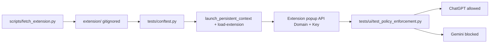

# Prompt Security — GenAI access policy automation

Automation that validates the **Prompt Security Browser Extension** enforces administrator policy for web GenAI apps:

- **Allow** `https://chatgpt.com/` — page loads, prompt input works, assistant reply appears.
- **Block** `https://gemini.google.com/` — adaptive detection (block UI, extension copy, disabled input, or no response after prompt).

Stack: Python 3.12, **pytest**, **pytest-asyncio**, async **Playwright**, **Allure**, **POM**, **uv**, **ruff**. Optional **Notion** “Test Runs” reporter (same fail-open design as the parent boilerplate).

## Architecture



The unpacked Chrome extension id at runtime **differs** from the Chrome Web Store id; tests resolve the `chrome-extension` id from the extension **service worker** URL.

## Prerequisites

- [uv](https://docs.astral.sh/uv/) and Python 3.12+
- Prompt Security **API key** and **API domain** (same values you enter in the extension popup)
- Network access to ChatGPT, Gemini, and Chrome Web Store CRX endpoint

## Local setup

```bash
cd PromptSecurity_HomeAssignment
uv sync --all-groups
uv run playwright install --with-deps chromium
cp .env.example .env
# Edit .env: set PROMPT_SECURITY_API_KEY (never commit real values)
make extension   # or: uv run python scripts/fetch_extension.py
uv run pytest -m smoke -v
```

Tests run **headed** Chromium with the extension (CI uses **Xvfb**). HTML report: `reports/report.html`. Allure raw results: `reports/allure-results/`.

## GitHub Actions CI

Workflow: [`.github/workflows/ci.yml`](.github/workflows/ci.yml).

1. Install uv, sync deps, install Playwright Chromium.
2. **Fetch + unpack** the extension (`scripts/fetch_extension.py`).
3. Install **Xvfb**, then run **`xvfb-run … uv run pytest -v`** so headed Chromium works on `ubuntu-latest`.
4. Upload Allure results, HTML report, summary, screenshots, traces.

### Required secret

| Name | Type | Purpose |
|------|------|---------|
| `PROMPT_SECURITY_API_KEY` | **Secret** | Extension API key (same as in the extension settings). |

Optional repository **Variables** (defaults in code match the vendor assignment): `PROMPT_SECURITY_API_DOMAIN` (`eu.prompt.security`), `CHROME_STORE_EXTENSION_ID` (only affects CRX download).

### Submission links

- **CI workflow:** [github.com/talmalek/prompt-security-home-assignment/actions/workflows/ci.yml](https://github.com/talmalek/prompt-security-home-assignment/actions/workflows/ci.yml)
- **Latest green run:** [run #24952738301](https://github.com/talmalek/prompt-security-home-assignment/actions/runs/24952738301) — `2 passed` (`test_chatgpt_is_allowed`, `test_gemini_is_blocked`).
- **Allure report (GitHub Pages):** <https://talmalek.github.io/prompt-security-home-assignment/> — published by [`.github/workflows/allure-report.yml`](.github/workflows/allure-report.yml) after every CI run on `main`.

## Notion stakeholder dashboard (new repo)

Use a **new** Notion integration and database for this repository (do not reuse the boilerplate’s production dashboard unless you intend to).

1. Create an integration at [Notion → Integrations](https://www.notion.so/profile/integrations) → copy `NOTION_TOKEN` (`ntn_…`).
2. Duplicate or create a **Test Runs** database; share it with the integration.
3. GitHub: Secret `NOTION_TOKEN`, Variables `NOTION_RUNS_DATABASE_ID`, `ALLURE_PAGES_URL`.
4. Locally: `uv run python scripts/smoke_notion.py` to verify schema.
5. Optionally once: `uv run python scripts/reshape_notion_page.py` (curates page copy; **not** for CI).

The reshape script still references “Sauce Demo” in template text — update your Notion page manually or adjust that script only for this product (it is a one-off curator).

## Test design notes

- **Black-box**: assertions are on user-visible outcomes, not extension internals.
- **Adaptive Gemini blocking**: `BlockEvidence` records which heuristic fired (URL, “Access Denied” modal, banner text, disabled/missing input, or no model response after prompt).
- **Trade-offs**: headed + Xvfb in CI is slower but reliable for MV3 extensions; locators may need updates if OpenAI/Google change their UIs.

## Risks and assumptions

- Policy is **backend-driven** via your API key; tests assume the assigned policy allows ChatGPT and blocks Gemini.
- ChatGPT may show login or regional gates; the smoke test expects a **guest or already-authenticated** path where the main prompt is reachable.
- Gemini and ChatGPT UIs change; POMs use resilient fallbacks but are not maintenance-free.

## Intentionally out of scope

- PII / DLP logic inside the extension
- Network interception or MITM-style tooling
- Over-engineered policy DSL or multi-tenant admin UIs

## License

MIT — see [LICENSE](LICENSE).
