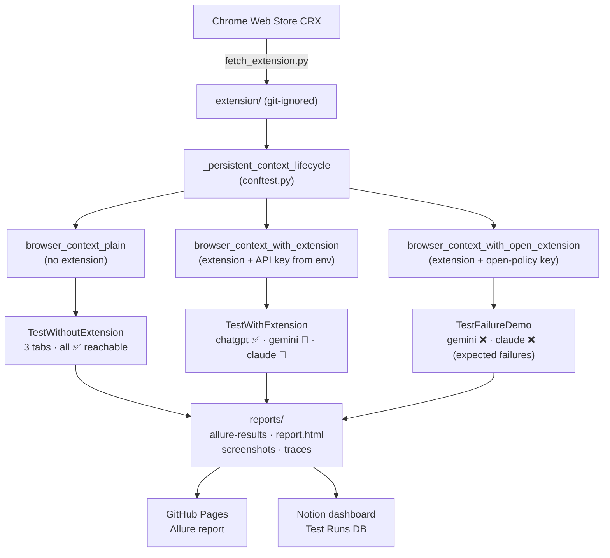

# Prompt Security — GenAI access policy automation

Automation that validates the **Prompt Security Browser Extension** enforces administrator policy for web GenAI apps.

The suite runs **8 test scenarios** across three pytest classes, each backed by its own Playwright fixture:

| Class | Fixture | Tab 1 — ChatGPT | Tab 2 — Gemini | Tab 3 — Claude AI |
|---|---|---|---|---|
| `TestWithoutExtension` | `browser_context_plain` | ✅ No block | ✅ No block | ✅ No block |
| `TestWithExtension` | `browser_context_with_extension` | ✅ No block (allow) | 🛑 **BLOCK** overlay | 🛑 **BLOCK** overlay |
| `TestFailureDemo` | `browser_context_with_open_extension` | — | ❌ Expected FAIL | ❌ Expected FAIL |

> The 2 demo tests use a **real API key with no block rules** to intentionally trigger
> assertion failures — they demonstrate the full failure-reporting pipeline
> (Allure step diff, screenshot, page source, Playwright trace).
> CI stays green via `continue-on-error: true`.

---

## How the infrastructure works

### 1 — Extension acquisition

`scripts/fetch_extension.py` downloads the CRX from the Chrome Web Store, strips
the CRX header, and unzips the payload to `extension/` (git-ignored).  The
unpacked directory is referenced by two Chromium launch flags:

```
--load-extension=<abs-path>
--disable-extensions-except=<abs-path>
```

This is done once per CI run (or `make extension` locally).

> **Always testing the latest release.**
> The download hits Google's own auto-update endpoint
> (`clients2.google.com/service/update2/crx`) — the same URL Chrome uses for
> extension updates — which always redirects to the **currently published CRX**.
> Because `extension/` is git-ignored and never cached in CI, every workflow run
> fetches a fresh copy automatically.  This means the test suite continuously
> validates whatever version is live in the Chrome Web Store, catching regressions
> introduced by new extension releases without any manual version pinning.
>
> **Local development behaviour.**
> Locally, the script skips the download if `extension/manifest.json` already
> exists.  This is intentional — it lets you write and debug tests against a
> known-good extension version without an unexpected mid-session update changing
> behaviour.  To pull the latest release explicitly, run:
> ```bash
> make extension   # equivalent to: uv run python scripts/fetch_extension.py --force
> ```

### 2 — Browser context fixtures

All fixtures are backed by a single shared lifecycle helper in `tests/conftest.py`:

```
_persistent_context_lifecycle(cls_name, with_extension, api_key_override?)
```

This helper:
1. Creates a per-class `reports/.user-data/<cls_name>/` persistent profile directory.
2. Launches `pw.chromium.launch_persistent_context` — headed, Xvfb in CI.
3. **If `with_extension=True`:** resolves the runtime `chrome-extension://<id>` from
   the MV3 service-worker URL (the id differs from the CRX Store id), then opens the
   extension popup and saves the API domain + key before handing off to the test class.
4. Starts a Playwright trace (`screenshots=True`, `snapshots=True`, `sources=True`).
5. On teardown: stops the trace → `reports/traces/<cls_name>.zip`.

Three fixtures call this helper:

| Fixture | `with_extension` | `api_key_override` |
|---|---|---|
| `browser_context_plain` | `False` | — |
| `browser_context_with_extension` | `True` | `settings.extension.api_key` (from env) |
| `browser_context_with_open_extension` | `True` | `cc6a6cfc-…` (open-policy key, hard-coded) |

### 3 — What the tests check

#### Baseline — `TestWithoutExtension`

Three tests, one tab each.  Navigates to ChatGPT / Gemini / Claude AI and asserts
the final URL scheme is `https` (not `chrome-extension://`).  This proves the three
sites are reachable in a vanilla browser — i.e. any block detected in
`TestWithExtension` is attributable to the extension, not the environment.

#### Policy enforcement — `TestWithExtension`

Three tests, one tab each, same three sites:

* **ChatGPT (allow):** final URL is a normal web origin — extension respects the
  allow rule.
* **Gemini (block):** final URL is
  `chrome-extension://<runtime-id>/html/pageOverlay.html?type=blockPage&domain=gemini.google.com&canBypass=Prevent&…`.
  Assertions key off parsed URL query parameters (`type`, `domain`, extension id,
  `canBypass`) — *not* fragile DOM text — so the failure message is itself the
  diagnosis.
* **Claude AI (block):** same as Gemini, `domain=claude.ai`.

DOM markers from the static `pageOverlay.html` template (populated at runtime by
`bundle/pageOverlay.bundle.js`) are collected as Allure evidence: `.title-text`
("Access Denied"), `.message-title` (administrator-blocked message such as
*"The domain claude.ai was blocked by your administrator"*), and the
`.powered-by` Prompt Security branding container.

> **Note on extension drift.** The extension's overlay has changed twice during
> this project. CI always fetches the latest CRX from the Chrome Web Store, so
> each shape was caught the moment it shipped and the tests were updated
> alongside:
>
> 1. **v7.0.49** — original static `pageOverlay.html` template, id-based
>    selectors (`#title-text`, `#message-title`, `#poweredBy`).
> 2. **v7.0.59** — switched to a **backend-rendered** HTML payload (URL query
>    carried `useBackendHtml=true` and a `popupToken`); selectors became
>    class-based (`.title`, `.description`) and the `body` gained a `.ai-site`
>    class.
> 3. **v7.0.591** *(current)* — reverted to the static `pageOverlay.html`
>    template populated at runtime by the bundle. The page object now waits for
>    `document.querySelector('.title-text')?.textContent` to be **non-empty**
>    (template ships the elements empty until the bundle hydrates them) and
>    asserts on `.title-text`, `.message-title`, and `.powered-by`. The
>    structural URL contract is unchanged — `chrome-extension://<id>/html/pageOverlay.html?type=blockPage&domain=…&canBypass=Prevent`
>    — and remains the primary diagnosis surface.

#### Failure pipeline demo — `TestFailureDemo`

Two tests that deliberately fail.  The fixture configures the extension with
`cc6a6cfc-9570-4e5a-b6ea-92d2adac90e4` — a real API key whose tenant has **no
block rules**.  The extension authenticates but receives an empty policy, so Gemini
and Claude AI load normally (scheme `https`).  The block assertions then fire and:

* A **failure screenshot** of the live page is taken and attached to Allure +
  `reports/screenshots/`.
* The **raw page HTML** is attached as `page_source`.
* The **Playwright trace** ZIP captures every step for Inspector post-mortem.

This confirms the full CI failure-evidence pipeline works before a real regression
ever occurs.

### 4 — Soft assertions

`utils/soft_assert.py::SoftAssert` wraps each check in its own Allure step.  All
failures within a test are collected and reported together at teardown — so you see
every failing assertion in one Allure result instead of stopping at the first.

### 5 — Reporting

| Artefact | Location | Produced by |
|---|---|---|
| Allure results | `reports/allure-results/` | `allure-pytest` |
| HTML summary | `reports/report.html` | `pytest-reporter-html1` (custom `html1/` template) |
| Failure screenshots | `reports/screenshots/` | `conftest.pytest_runtest_makereport` hook |
| Playwright traces | `reports/traces/` | `_persistent_context_lifecycle` |
| Notion row | cloud | `scripts/push_to_notion.py` (CI, fail-open) |
| GitHub Pages Allure | <https://talmalek.github.io/prompt-security-home-assignment/> | `allure-report.yml` |

---

## Architecture diagram



---

## Prerequisites

- [uv](https://docs.astral.sh/uv/) and Python 3.12+
- Prompt Security **API key** and **API domain** (values you enter in the extension popup)
- Network access to ChatGPT, Gemini, Claude AI, and the Chrome Web Store CRX endpoint

## Local setup

```bash
cd PromptSecurity_HomeAssignment
uv sync --all-groups
uv run playwright install --with-deps chromium
cp .env.example .env
# Edit .env — set PROMPT_SECURITY_API_KEY (never commit real values)
make extension          # downloads + unpacks the CRX
uv run pytest -m smoke -v           # 6 production tests
uv run pytest -v                    # all 8 (6 pass + 2 expected failures)
uv run allure serve reports/allure-results   # open Allure locally
```

Tests run **headed** Chromium (CI uses **Xvfb**).  HTML report: `reports/report.html`.

## GitHub Actions CI

Workflow: [`.github/workflows/ci.yml`](.github/workflows/ci.yml)

1. Sync deps, install Playwright Chromium, fetch + unpack extension.
2. Install **Xvfb** then run `xvfb-run … uv run pytest -v` — all **8 tests**.
3. Pytest step has `continue-on-error: true`: the 2 expected demo failures emit a
   `::warning::` in the log but never turn the workflow red.
4. Upload Allure results, HTML report, summary JSON, screenshots, traces.
5. Allure report published to GitHub Pages by `allure-report.yml`.
6. Notion row posted by `scripts/push_to_notion.py` (fail-open).

### Required secret

| Name | Type | Purpose |
|------|------|---------|
| `PROMPT_SECURITY_API_KEY` | **Secret** | Extension API key for the block-policy tenant. |

Optional repository **Variables** (defaults match vendor assignment):
`PROMPT_SECURITY_API_DOMAIN` (`eu.prompt.security`),
`CHROME_STORE_EXTENSION_ID` (only affects CRX download).

### Submission links

- **CI workflow:** [github.com/talmalek/prompt-security-home-assignment/actions](https://github.com/talmalek/prompt-security-home-assignment/actions/workflows/ci.yml)
- **Latest run:** see the Actions tab — 8 tests total: 6 passed + 2 expected failures (demo).
- **Allure report (GitHub Pages):** <https://talmalek.github.io/prompt-security-home-assignment/>
- **Notion stakeholder dashboard:** [QA Automation Test Runs (Prompt Security)](https://nickel-guide-250.notion.site/QA-Automation-Test-Runs-Prompt-Security-34e30027917080b2be80efea0c3c55ec) — every CI run on `main` appends one row (status, duration, branch/commit, links to CI run + Allure report).

---

## Notion stakeholder dashboard

Lightweight reporter that posts one row per CI run to the [QA Automation Test Runs (Prompt Security)](https://nickel-guide-250.notion.site/QA-Automation-Test-Runs-Prompt-Security-34e30027917080b2be80efea0c3c55ec) Notion database.
**Opt-in and fail-open** — a Notion outage never fails CI (`continue-on-error: true`
plus `if: env.NOTION_TOKEN != ''` gating).

| File | Role |
|---|---|
| `utils/notion_client.py` | Async httpx + tenacity wrapper; `TestRunRow` pydantic model. |
| `utils/pytest_summary.py` | Zero-dep pytest plugin → writes `reports/summary.json`. |
| `scripts/push_to_notion.py` | CI publisher (also runs locally). Always exits 0. |
| `scripts/smoke_notion.py` | Read-only schema/auth pre-flight. |
| `scripts/reshape_notion_page.py` | One-off page curator — idempotent, **not** in CI. |

To wire a fresh Notion page:

1. Create an internal integration at [Notion → Integrations](https://www.notion.so/profile/integrations).
2. Duplicate the curated page (or create one with a `Test Runs` database matching the `smoke_notion.py` schema).
3. Open the page → **⋯ → Connections → Add connections → confirm**.
4. Set GitHub Secret `NOTION_TOKEN`, Variables `NOTION_RUNS_DATABASE_ID`, `ALLURE_PAGES_URL`.
5. Validate: `uv run python scripts/smoke_notion.py && uv run python scripts/push_to_notion.py`.
6. Re-curate page narrative: `uv run python scripts/reshape_notion_page.py`.

---

## Test design notes

- **Black-box**: all assertions are on user-visible outcomes (URL structure, extension overlay
  query params), not on extension internals or network traffic.
- **Two production fixtures, one lifecycle helper** — `browser_context_plain` and
  `browser_context_with_extension` delegate entirely to `_persistent_context_lifecycle()`.
  The `api_key_override` param enables a third fixture for the demo without duplicating code.
- **One generic page object** (`tests/pages/web_app_page.py::WebGenAiAppPage`) with three
  site descriptors (`CHATGPT`, `GEMINI`, `CLAUDE`).  The post-navigation snapshot returns a
  "real web origin" record or an `overlay` sub-dict with the extension's block metadata.
- **Block evidence is structural** — assertions key off the parsed
  `chrome-extension://<id>/html/pageOverlay.html?type=blockPage&domain=…` query string.
  Failure messages double as diagnostics (e.g. *"overlay declares wrong blocked domain"*).
- **Soft assertions** via `SoftAssert` — every check is its own Allure step; all collected
  failures are reported together at teardown.
- **Intentional failure demo** is isolated in `tests/ui/test_failure_demo.py` with a clean
  removal checklist in the module docstring — nothing else changes when it's deleted.
- **TAB_OFFSET class variable** on each test class shifts tab numbering in Allure steps,
  enabling future parallel runs with globally unique tab labels.

## Risks and assumptions

- Policy is **backend-driven** via the API key — tests assume the block-policy tenant
  *allows* ChatGPT and *blocks* Gemini and Claude AI.
- "Site loads" in `TestWithoutExtension` is intentionally lenient — login walls and
  regional redirects are accepted as long as the URL scheme is `https`, not
  `chrome-extension://`.
- Vendor UIs change; the page object only relies on URL structure (stable) and a handful
  of optional DOM markers from the extension's own overlay — minimising flaky failure modes.
- Headed + Xvfb in CI is slower (~30 s) but the only reliable mode for MV3 extensions that
  intercept navigation events.

## Intentionally out of scope

- PII / DLP logic inside the extension
- Network interception or MITM-style tooling
- Multi-tenant admin-UI testing

## License

MIT — see [LICENSE](LICENSE).
